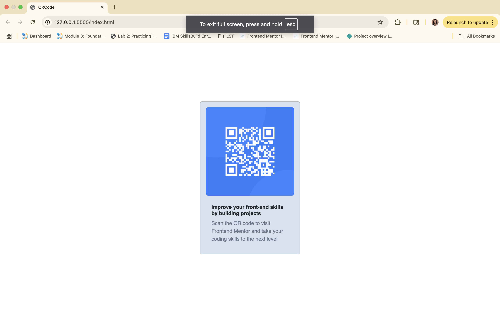

# Frontend Mentor - QR code component solution

This is a solution to the Lab3.Developing with Bootstrap.

## Table of contents

- [QR code with Bootstrap](#qr-code-with Bootstrap)
  - [Table of contents](#table-of-contents)
  - [Overview](#overview)
    - [Screenshot](#screenshot)
    - [Links](#links)
  - [My process](#my-process)
    - [Built with](#built-with)
    - [What I learned](#what-i-learned)
    - [Continued development](#continued-development)
    - [Useful resources](#useful-resources)

## Overview
FirstMentor QR code project was implemented using html and css. Purpose of this project is to refactor using bootstarp utility classes and componenets to achieved the desired output.

### Screenshot

### Links
-Github URL:[Github link](https://github.com/aswinirkaranth/Lab3.BootstrapQRCode)

## My process
 1.As per requirement forked the code from previous project.
 2.Commited base code to github repo.
   3.Commented the existing css file and included CDN for bootstap.
   4. Using card component from bootstrap.
   https://getbootstrap.com/docs/5.3/components/card/
   5.Use spacing utilities 
   https://getbootstrap.com/docs/5.3/utilities/spacing/

### Built with

- Semantic HTML5
- CSS custom properties
- Sass 

### What I learned
Align card to center of screen
1. mx-auto centered the element to the center of x axis because the bootstrap card defines a width.
   However unless parent container has a height defined my-auto will not work because it doesnt know where to center the card in the y-axis. So define viewport height as auto in display flex for the container.

    

        

2. Custom colors 
   By defining custom css class and including that in html.
.bg-custom-slate {
    background-color: hsl(212, 45%, 89%) !important;
}
 

 
3. Custom font 
Used the provided link 
- Family: [Outfit](https://fonts.google.com/specimen/Outfit) to get code embedding from the webiste.
  Defined outfit-regular and outfit-bold custom classes in css file for the given font weights
- Weights: 400, 700
  

### Continued development

Instead of CDN use npm.

### Useful resources

-[Bootstrap reference site](https://getbootstrap.com/) - For spacing, alignment,custom css class, bootstrap components.
-[Outfit](https://fonts.google.com/specimen/Outfit) - Custom fonts and how to use Sass @import.

